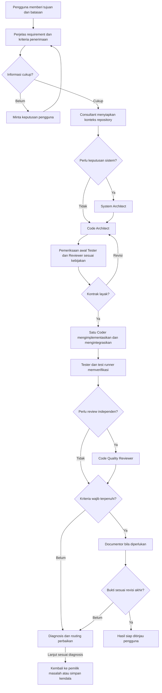
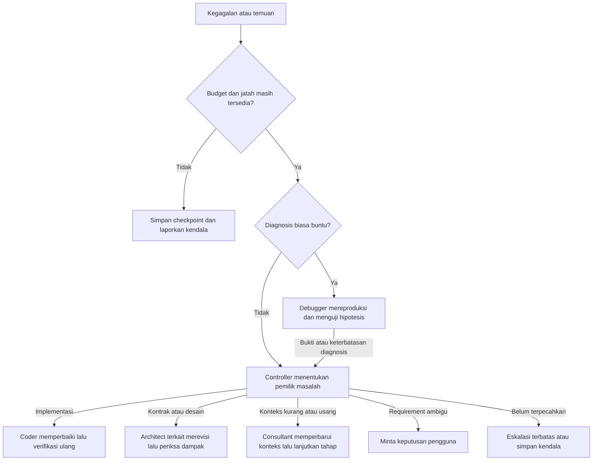

# Workflow agent untuk pengembangan software

Status: workflow MVP. Diperbarui: 9 Oktober 2026.

Harness ini membantu mengembangkan software melalui mode Consultant, System Architect, Code Architect, Coder, Tester, Code Quality Reviewer, Debugger, dan Documentor. MVP menjalankan satu Coder aktif; role lain dipanggil bergiliran sesuai kebutuhan. Model murah digunakan untuk pekerjaan dengan lingkup jelas; pekerjaan yang ambigu atau gagal berulang dapat dialihkan ke model lebih kuat. Keberhasilan tetap ditentukan oleh requirement dan bukti verifikasi.

Arsitektur dan trade-off dijelaskan di [Arsitektur harness](harness-architecture.md). CLI sudah mengimplementasikan role dan alur utama di bawah; cara menjalankan, konfigurasi dan batasnya dijelaskan di [panduan penggunaan](usage.md). Bukti simulator menguji mekanisme workflow, bukan kualitas model live.

## Prinsip alur kerja

- Pengguna menentukan tujuan, batasan bisnis, dan kriteria penerimaan. Agent boleh mengidentifikasi kekurangan informasi dan mengusulkan asumsi secara eksplisit.
- Workflow Controller mengatur urutan, status, anggaran, dan perpindahan tahap menggunakan aturan program. Controller bukan role LLM tambahan.
- Setiap role menerima kontrak tugas dan konteks yang relevan, lalu menyerahkan artefak yang dapat diperiksa.
- Semua role tersedia sebagai mode mandiri. Menjalankan satu mode tidak otomatis menjalankan seluruh pipeline.
- System Architect dapat dilewati jika arsitektur pengguna sudah cukup untuk tugas tersebut.
- Consultant memahami repository dan menyediakan konteks bersama serta konteks khusus tugas. Agent penerima tetap dapat memeriksa sumber dan meminta informasi tambahan.
- Code Architect memiliki kontrak teknis. Tester menyusun cara pembuktiannya dan memeriksa testability sebelum coding bila kompleksitas tugas membutuhkannya.
- Setiap role memeriksa pekerjaannya sendiri. Reviewer terpisah memberi pemeriksaan independen sesuai risiko; Debugger hanya dipanggil ketika diagnosis biasa buntu.
- Coder memiliki patch akhir dan integrasi perubahan. Tester memverifikasi hasil gabungan; Controller memeriksa bukti sebelum menerima hasil.
- Test runner menghasilkan bukti eksekusi. Pernyataan agent bahwa tugas sudah selesai tidak cukup untuk melewati pemeriksaan wajib.

## Diagram workflow fitur

Diagram ini menunjukkan workflow fitur standar. Semua perpindahan tahap dikelola Controller. Pemeriksaan awal Tester dipilih berdasarkan kompleksitas; pemeriksaan independen Reviewer dipilih berdasarkan risiko. Ketika keduanya diperlukan sebelum coding, Tester memeriksa testability dan Reviewer memeriksa kesesuaian desain.

Pemeriksaan awal dapat dilewati pada tugas sederhana; validasi kontrak oleh Controller tetap berjalan. Consultant dapat menggunakan kembali konteks yang masih cocok dengan revisi repository. Temuan yang memblokir requirement mengembalikan pekerjaan ke klarifikasi pengguna, bukan diselesaikan dengan asumsi tersembunyi.

MVP memperbarui konteks Consultant ketika snapshot berubah sebelum role lanjutan. Pemeriksaan akhir menjalankan ulang check yang diwajibkan; jika dokumentasi mengubah snapshot, Reviewer yang wajib juga dijalankan kembali. Run menyimpan task dan konfigurasi tetap; klarifikasi ditambahkan melalui resume, sedangkan perubahan acceptance criteria memerlukan run baru.

Controller menerapkan batas waktu, biaya, dan pengulangan pada seluruh loop. Kegagalan dari tahap mana pun mengikuti alur pemulihan berikut. Selesai berarti artefak siap ditinjau; merge atau deployment merupakan tindakan terpisah sesuai otorisasi pengguna.

## Peran dalam gambaran besar

| Peran | Keputusan dan tanggung jawab | Input utama | Output wajib | Batas kewenangan |
| --- | --- | --- | --- | --- |
| Pengguna | Menentukan tujuan, prioritas, dan keputusan bisnis yang belum jelas | Kebutuhan bisnis dan kondisi proyek | Requirement, batasan, keputusan atas pertanyaan penting | Agent tidak menggantikan keputusan bisnis dengan asumsi tersembunyi |
| Consultant | Memahami repository dan memilih informasi yang relevan untuk tiap role | Task brief, kode, test, aturan proyek dan keputusan yang ada | Peta repository, konteks bersama, konteks khusus tugas, referensi sumber dan ketidakpastian | Tidak mengambil alih keputusan desain atau menjadi satu-satunya jalur membaca sumber |
| System Architect | Merancang batas sistem, aliran data, teknologi, scale, dan trade-off | Requirement, arsitektur yang ada, batas operasional | Desain sistem dan catatan keputusan beserta alternatif | Tidak mengganti arsitektur inti tanpa alasan dan penanganan dampaknya |
| Code Architect | Membagi pekerjaan menjadi unit implementasi dengan kontrak yang jelas | Desain sistem, kode relevan, acceptance criteria | Rencana, interface, invariant, input/output, error, dependensi dan target performa | Tidak perlu menentukan semua fungsi privat; tidak mengubah requirement sepihak |
| Coder | Membuat patch sebaik mungkin dalam lingkup tugas, mengintegrasikan perubahan, menjalankan pemeriksaan lokal dan memperbaiki temuan | Task contract, konteks kode, skill implementasi | Patch akhir yang menyatu, hasil pemeriksaan, kendala dan penyimpangan | Tidak boleh melemahkan acceptance criteria atau test; adanya Reviewer tidak menurunkan standar implementasi |
| Tester | Memeriksa testability sesuai kompleksitas, merancang pengujian dari requirement, mengeksekusi dan menganalisis hasil termasuk integrasi | Requirement asli, kontrak, revisi kode, lingkungan uji | Rencana verifikasi, test, hasil runner, kasus gagal dan benchmark bila relevan | Tidak menetapkan makna bisnis atau kontrak teknis sepihak; tidak menjadikan kode sebagai satu-satunya sumber kebenaran |
| Code Quality Reviewer | Memberi pemeriksaan independen atas kesesuaian requirement, desain, kode dan bukti test sesuai risiko | Requirement, rencana, diff, kode sekitar, bukti test | Temuan berlokasi dan berbukti, dampak, prioritas serta usulan perbaikan | Tidak mengulang seluruh pekerjaan Tester; pisahkan temuan yang memblokir dari saran opsional; default hanya membaca |
| Debugger | Mereproduksi kegagalan dan menguji penyebab saat diagnosis biasa buntu | Requirement, kontrak, konteks relevan, snapshot gagal dan riwayat percobaan | Laporan diagnosis, hipotesis yang diuji, bukti dan usulan perbaikan terkecil | Dipanggil sesuai kebutuhan; patch produk tetap milik Coder, keputusan kontrak tetap milik Architect |
| Documentor | Menjelaskan perilaku yang sudah diverifikasi | Implementasi akhir, kontrak dan bukti verifikasi | Dokumentasi penggunaan, API, operasional dan keputusan yang berubah | Tidak mengklaim fitur yang baru direncanakan sebagai sudah tersedia |

System Architect menggunakan skill OOP, algoritma, sistem terdistribusi, database, AI, ML, atau LLM sesuai masalah. Prinsip dan pola desain dipilih karena kebutuhan; semua proyek tidak wajib menggunakan semua skill. Istilah AAT dan sisparter dari diskusi awal masih memerlukan definisi sebelum menjadi paket skill tersendiri.

## Batas Code Architect dan Tester

| Hal yang ditentukan | Pemilik utama | Kontribusi role lain |
| --- | --- | --- |
| Perilaku yang dibutuhkan bisnis dan acceptance criteria | Pengguna melalui klarifikasi requirement | Architect dan Tester boleh menemukan ambiguitas dan mengusulkan perbaikan |
| Kontrak teknis, input/output, error, invariant dan batas performa | Code Architect mengikuti keputusan sistem | Tester memeriksa apakah kontrak cukup jelas untuk diuji |
| Skenario, data uji, metode dan lingkungan pembuktian | Tester | Code Architect menyediakan kontrak dan batasan; Coder dapat menambahkan pemeriksaan lokal |
| Implementasi dan integrasi patch | Coder | Tester memverifikasi hasil, Reviewer menilai sesuai risiko |

Contoh: requirement melarang tagihan ganda ketika permintaan pembayaran diulang. Code Architect merancang kontrak idempotency dan perilaku status transaksi. Tester menyusun skenario pengulangan, permintaan bersamaan, timeout dan kegagalan di tengah proses. Coder mengimplementasikan mekanisme tersebut. Jika skenario mengungkap kontrak yang kurang lengkap, revisinya kembali ke Code Architect; perubahan makna bisnis kembali ke pengguna.

## Pemeriksaan mandiri dan review independen

Setiap role wajib memeriksa keluarannya sendiri. Reviewer terpisah berfokus pada ketidaksesuaian antartahap, batas modul, kompleksitas yang tidak diperlukan, serta konsekuensi kompatibilitas, data atau operasional pada bagian yang berubah. Reviewer tidak perlu mendesain ulang sistem atau mengulang seluruh eksekusi test.

Workflow Policy menetapkan kapan Reviewer wajib berdasarkan risiko perubahan, misalnya perubahan kontrak publik, integritas data, atau arsitektur lintas modul. Pada tugas kecil berisiko rendah, Reviewer terpisah boleh dilewati dengan alasan tercatat; pemeriksaan otomatis yang diwajibkan tetap berjalan. Setiap temuan menyertakan bukti dan dampak, serta membedakan penghambat penerimaan dari saran opsional.

## Preset dan mode mandiri

| Pilihan | Alur | Pemakaian |
| --- | --- | --- |
| Perbaikan kecil | Intake → konteks Consultant → Coder → pemeriksaan otomatis → Reviewer bila diwajibkan risiko | Bug atau perubahan terbatas dengan perilaku tujuan yang jelas |
| Fitur standar | Intake → Consultant → Code Architect → pemeriksaan awal sesuai kebijakan → Coder → Tester → Reviewer sesuai risiko → dokumentasi bila perlu | Tester awal memeriksa testability; Reviewer awal memeriksa desain bila diperlukan |
| Perubahan sistem | Intake → Consultant → System Architect → Code Architect → kelanjutan workflow fitur standar | Perubahan penyimpanan data, komunikasi antarkomponen, scale, atau batas sistem |
| Evaluasi kode | Intake → konteks Consultant → Reviewer → laporan temuan | Audit kode tanpa otomatis melakukan refactor |
| Dokumentasi | Intake → konteks Consultant → Documentor → pemeriksaan terhadap implementasi | Memperbarui dokumentasi tanpa perubahan perilaku aplikasi |
| Diagnosis saat buntu | Checkpoint gagal → Debugger → routing hasil diagnosis | Jalur pemulihan opsional, bukan tahap tetap setiap task |
| Role mandiri | Validasi input → role pilihan → validasi output | Pengguna sudah mempunyai artefak dari tahap sebelumnya |

Mode mandiri tetap membutuhkan input yang valid. Contohnya, memilih Coder dengan requirement ambigu menghasilkan permintaan klarifikasi atau kebutuhan rencana; tidak diam-diam memanggil seluruh workflow berbiaya tinggi.

Konteks Consultant yang sudah valid dapat digunakan kembali tanpa pemanggilan model baru. Role mandiri dapat menerima paket konteks pengguna selama referensi dan kelengkapannya diperiksa. MVP tidak memiliki Integration Agent atau beberapa Coder paralel: satu Coder bertanggung jawab atas patch akhir, Tester atas verifikasi integrasi, dan Controller atas pemeriksaan bukti.

## Kontrak handoff

Handoff menggunakan artefak terstruktur, bukan hanya pesan percakapan. Setiap artefak mencatat versi skema, pembuat, sumber input, revisi repository, dan status validasi. Uraian manusia tetap disertakan untuk menjelaskan alasan keputusan.

| Artefak | Isi minimum | Pemilik |
| --- | --- | --- |
| Requirement brief | Tujuan, scope, non-goals, acceptance criteria ber-ID, batasan dan asumsi | Pengguna dibantu tahap intake |
| Repository context | Konteks bersama dan khusus tugas/role, referensi file/simbol, snapshot, fakta, dugaan, pertanyaan dan dependensi sumber | Consultant; Context Builder mengemasnya untuk penerima |
| Architecture decision | Keputusan sistem, alternatif, trade-off, konsekuensi dan kondisi peninjauan ulang | System Architect atau pengguna |
| Task contract | ID tugas, requirement terkait, input/output, error, invariant, batas file/modul, dependensi, cara verifikasi | Code Architect |
| Verification plan | Pemetaan acceptance criteria ke skenario, data, metode, lingkungan, ambang yang disepakati dan celah testability | Tester; kontrak teknis tetap milik Code Architect |
| Implementation result | Patch akhir terintegrasi, revisi dasar dan akhir, penjelasan perubahan, hasil pemeriksaan lokal, kendala | Coder |
| Verification report | ID requirement, skenario, command, exit code, log, revisi kode, lingkungan dan hasil benchmark | Tester melalui runner |
| Review report | Lokasi, bukti, dampak, prioritas, usulan perbaikan, keputusan atas temuan | Reviewer |
| Diagnosis report | Reproduksi, snapshot gagal, hipotesis yang diuji/ditolak, bukti, ketidakpastian dan usulan perbaikan | Debugger |
| Completion record | Artefak akhir, pemeriksaan yang lulus, keterbatasan tersisa, biaya dan durasi | Controller |

Contoh kontrak: untuk fitur pagination, input mencakup cursor dan limit; output mencakup daftar item dan cursor berikutnya. Kontrak menjelaskan urutan data yang stabil, perilaku cursor invalid, batas limit, dan pengujian pada data kosong. Target latency baru menjadi syarat ketika dataset, beban, lingkungan, serta ambangnya ditentukan.

Jika requirement, keputusan arsitektur, atau sumber repository berubah, artefak turunannya ditandai perlu ditinjau ulang. Konteks Consultant yang terdampak diperbarui sebelum digunakan kembali. Hasil test lama tidak otomatis membuktikan revisi kode yang baru.

## Routing kegagalan dan eskalasi

| Kondisi | Tindakan Controller |
| --- | --- |
| Respons model melanggar skema | Kembalikan error validasi untuk koreksi terbatas; jangan jalankan tool dari keluaran invalid |
| Test gagal karena implementasi | Kirim kasus gagal dan bukti kepada Coder, lalu jalankan verifikasi ulang |
| Konteks kurang atau tidak cocok dengan snapshot | Minta Consultant memperbarui sumber dan paket konteks; agent penerima tetap boleh memeriksa sumber langsung |
| Kontrak tidak mungkin dipenuhi | Kembalikan ke Code Architect; jika menyangkut keputusan sistem, lanjutkan ke System Architect |
| Reviewer menemukan coupling atau kompleksitas yang merugikan | Buat tugas perbaikan terarah; setelah patch, ulangi pemeriksaan yang terdampak |
| Requirement saling bertentangan | Minta keputusan pengguna; pekerjaan independen boleh dilanjutkan |
| Timeout atau provider tidak tersedia | Retry terbatas atau provider fallback yang kompatibel; catat provider aktual |
| Kegagalan berulang, tidak konsisten atau penyebab belum terbukti setelah diagnosis biasa | Panggil Debugger dalam budget; arahkan hasilnya ke Coder, Architect, Consultant atau pengguna sesuai pemilik masalah |
| Diagnosis belum cukup atau kemampuan model tidak memadai | Eskalasi model secara terbatas bila budget tersedia; jika tetap buntu, simpan checkpoint dan laporkan keterbatasan |
| Batas biaya, waktu atau iterasi tercapai | Simpan checkpoint, laporkan pekerjaan tersisa, jangan menandai tugas selesai |

Usulan awal: maksimum dua putaran perbaikan pada model murah sebelum diagnosis ulang. Bila diagnosis biasa buntu, beri satu sesi Debugger dengan batas tool call dan waktu, serta paling banyak satu eskalasi kualitas per task. Model lebih kuat untuk sesi Debugger dihitung sebagai eskalasi tersebut. Nilai ini konfigurasi awal untuk eksperimen, bukan batas yang sudah terbukti optimal. Batas biaya total selalu mengungguli jatah iterasi; pemanggilan Debugger tidak mereset anggaran atau jatah task.

Fallback infrastruktur dan eskalasi kualitas memiliki tujuan berbeda. Mengganti endpoint karena timeout tidak membuktikan bahwa model pengganti mampu menyelesaikan task yang lebih sulit.

## Kriteria selesai

Controller hanya menerima hasil jika semua syarat wajib pada preset terpenuhi:

1. Acceptance criteria wajib telah dipetakan ke bukti yang relevan.
2. Build, type check, test, dan benchmark yang diwajibkan berhasil pada revisi akhir; yang tidak relevan dicatat sebagai tidak berlaku beserta alasannya.
3. Perubahan lintas modul sudah diperiksa secara integrasi.
4. Temuan yang memblokir sudah diperbaiki atau ditangani melalui keputusan pengguna yang eksplisit.
5. Dokumentasi yang terdampak sudah diperbarui. Perubahan kode setelah review atau dokumentasi membatalkan bukti terkait dan memicu verifikasi ulang.
6. Tidak ada pertanyaan penting atau kegagalan tool yang disembunyikan sebagai keberhasilan.

Untuk review mandiri, selesai berarti laporan review lengkap. Untuk dokumentasi mandiri, selesai berarti dokumentasi sesuai sumber. Consultant menyerahkan konteks dengan sumber dan ketidakpastian; Debugger menyerahkan diagnosis beserta bukti atau keterbatasannya. Selesainya role-role ini tidak menyatakan bug sudah diperbaiki atau seluruh aplikasi telah lolos pengujian.

## Evaluasi harness

Bandingkan workflow beberapa role dengan baseline satu agent pada kumpulan task yang sama: bug fix, fitur kecil, refactor, dan perubahan lintas modul. Gunakan snapshot repository dan batas anggaran yang sama, serta beberapa pengulangan agar hasil tidak bergantung pada satu percobaan.

Catat keberhasilan berdasarkan acceptance criteria, cacat yang lolos review, jumlah intervensi pengguna, durasi, jumlah retry, dan biaya seluruh percobaan. Biaya per tugas diterima adalah total biaya eksperimen dibagi jumlah tugas yang memenuhi kriteria; jika tidak ada tugas diterima, laporkan kegagalan tanpa menghitung rasio tersebut.

Evaluasi berbasis task nyata, pencatatan hasil, dan kalibrasi penilaian otomatis dengan manusia mengikuti prinsip [OpenAI Docs tentang evaluasi](https://developers.openai.com/api/docs/guides/evaluation-best-practices). Pembagian role dan batas iterasi di sini merupakan usulan desain yang perlu diuji.
