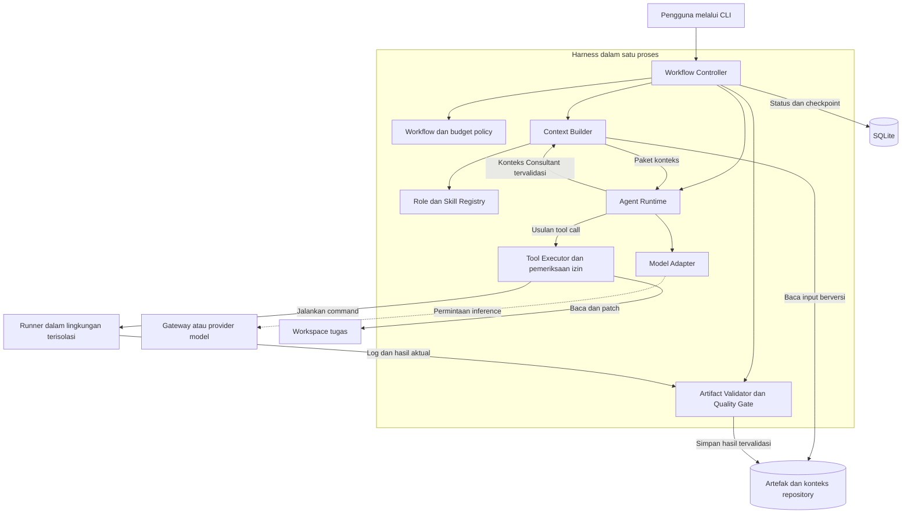

# Arsitektur harness dan trade-off teknologi

Status: arsitektur MVP dengan catatan implementasi. Diperbarui: 9 Oktober 2026.

Harness dirancang sebagai aplikasi lokal yang modular, dengan satu runtime untuk menjalankan berbagai role. Model, skill, tool, konteks, dan workflow dapat diganti melalui kontrak yang jelas. Tujuan awalnya adalah biaya operasional rendah, perubahan yang mudah ditinjau, dan kemampuan membuktikan hasil pekerjaan.

Alur dan tanggung jawab setiap role dijelaskan di [Workflow agent](agent-workflow.md). Runtime CLI sudah tersedia; cara menjalankan dan batas implementasinya ada di [panduan penggunaan](usage.md).

## Status implementasi MVP

- Python, Pydantic, HTTPX dan SQLite digunakan dalam paket `goodhands`.
- Semua delapan role tersedia melalui registry deklaratif, dengan preset quick, feature, system dan mode role mandiri.
- OpenRouter menjadi konfigurasi default, dengan adapter Chat Completions kompatibel untuk alternatif seperti Vercel AI Gateway. Provider live memerlukan key dan model ID pengguna; tidak ada hosting cloud yang diperlukan.
- Eksekusi masih sinkron dan berurutan. Snapshot menggunakan salinan direktori, bukan Git worktree, agar repository tanpa Git juga didukung.
- Runner lokal memerlukan izin eksplisit; runner Docker memiliki batas filesystem/jaringan/sumber daya. Jalur Docker belum terverifikasi pada engine lingkungan ini.
- Checkpoint, resume, hash file, invalidasi bukti, batas biaya, review sesuai risiko, Debugger saat buntu, diff dan apply sudah tersedia.
- Pengujian memakai simulator model dengan eksekusi test nyata serta mock HTTP. Kualitas model live belum dibuktikan; tidak ada kredensial provider pada lingkungan pengembangan saat implementasi.

Bagian keputusan di bawah mempertahankan trade-off desain. Hal yang belum ada di MVP meliputi streaming, fallback lintas gateway, vector retrieval, worker paralel, dependency graph konteks dan plugin kode dinamis.

## Kebutuhan dan asumsi

Kesepakatan pembagian kerja: beberapa mode yang dapat dipilih, Consultant sebagai penyedia pemahaman repository, System Architect opsional, kontrak teknis milik Code Architect, rencana pengujian milik Tester, Reviewer independen sesuai risiko, dan Debugger hanya saat diagnosis biasa buntu. MVP memakai satu Coder aktif yang memiliki patch akhir dan integrasi perubahan. Model murah menjadi kandidat untuk pekerjaan terbatas; komponen dan skill tetap dapat dipasang atau dilepas.

Asumsi untuk MVP: satu pengguna, satu mesin, satu workflow aktif, akses ke repository lokal, dan antarmuka CLI. Bahasa implementasi diusulkan Python. Asumsi ini dapat diganti jika pengguna membutuhkan aplikasi web, tim bersama, atau integrasi dominan TypeScript.

OpenRouter disediakan sebagai default implementasi yang dapat diganti; Vercel AI Gateway dan provider langsung tetap alternatif. Model aktual tidak ditetapkan atas nama pengguna. Nama model, dukungan tool dan harganya perlu diverifikasi saat konfigurasi live dibuat.

## Diagram komponen

Kotak di dalam Harness merupakan modul dalam satu aplikasi, bukan layanan yang harus dideploy terpisah. Panah menunjukkan hubungan utama; hasil pemanggilan kembali ke pemanggilnya.

Consultant dan Debugger adalah role dalam Agent Runtime yang sama. Consultant menghasilkan pemahaman repository melalui tool baca, lalu hasilnya divalidasi dan disimpan sebagai artefak. Context Builder mengemas hasil itu untuk role berikutnya. Debugger memakai model adapter dan runner yang sama, dengan izin diagnosis terbatas; keduanya tidak memerlukan service baru.

## Batas tanggung jawab modul

Jalur konfigurasi memiliki agent Configurator tersendiri (`configurator.py`) dengan prompt
khusus, output terstruktur, dan maksimal tiga respons untuk menyusun/memperbaiki draft.
Registry (`registry.py`) membaca README berfrontmatter YAML dan skill eksplisit; validator
serta compiler JSON berjalan tanpa LLM. CLI authoring berada di `agents_cli.py`, sementara
budget request/accounting digunakan bersama dengan runtime engineering melalui `inference.py`.
Definisi dibekukan saat run dibuat, dan JSON kompilasi merupakan artefak turunan. Pilihan
format, batas kemampuan, dan trade-off dijelaskan di [konfigurasi agent](agent-configuration.md).

| Modul | Tanggung jawab | Batas |
| --- | --- | --- |
| Workflow Controller | Menjalankan state machine, satu Coder aktif, checkpoint, routing diagnosis dan eskalasi | Tidak menyerahkan keputusan selesai atau anggaran sepenuhnya kepada LLM |
| Workflow Policy | Mengatur tahap wajib, keterlibatan awal Tester, review sesuai risiko, pemicu Debugger, izin dan budget | Tidak menyimpan prompt role atau kredensial provider; role tidak boleh menurunkan pemeriksaan wajib sendiri |
| Agent Runtime | Menjalankan siklus model → usulan tool → hasil tool → model sesuai role aktif | Tidak melakukan perubahan filesystem di luar Tool Executor |
| Role Registry | Menyimpan tanggung jawab, input/output, tool yang diizinkan dan profil model | Tidak mengikat role ke satu merek model |
| Skill Registry | Menyediakan instruksi domain atau prosedur yang dibutuhkan task | Skill tidak menambah izin tool atau mengubah acceptance criteria sendiri |
| Context Builder | Mengemas konteks bersama dan konteks khusus role/tugas dari Consultant serta artefak sumber, memeriksa versi dan budget token | Tidak mengambil alih interpretasi repository atau keputusan desain; tidak mengirim seluruh histori secara default |
| Model Adapter | Menerjemahkan request/response, tool call, usage dan error provider | Tidak menentukan alur bisnis atau menjalankan shell |
| Tool Executor | Memvalidasi argumen, izin, batas workspace, timeout dan eksekusi tool | Output model adalah usulan tindakan, bukan otorisasi |
| Artifact Store dan State Store | Menyimpan dokumen, referensi versi, hasil dan status eksekusi | Ringkasan percakapan tidak menggantikan artefak sumber |
| Artifact Validator dan Quality Gate | Memeriksa skema, kelengkapan bukti, revisi kode dan kriteria selesai | Validitas JSON tidak dianggap sebagai bukti kebenaran perilaku |

## Teknologi MVP dan alternatif

Tabel berikut menjelaskan baseline implementasi beserta alternatif pengembangannya.

| Area | Usulan | Alasan | Trade-off dan alternatif |
| --- | --- | --- | --- |
| Bahasa runtime | Python dengan type hints | Memudahkan otomasi lokal dan integrasi pekerjaan AI atau ML | Type checking perlu dijalankan; TypeScript lebih menarik jika tim dan UI dominan JavaScript |
| Eksekusi I/O | HTTPX sinkron dan subprocess, dengan alur role berurutan | Menjaga checkpoint dan urutan mutasi sederhana pada MVP | asyncio dapat ditambahkan jika ada pekerjaan I/O independen; cancellation perlu mempertahankan accounting dan outcome tool |
| Kontrak data | Pydantic dan JSON Schema | Input/output antarrole serta konfigurasi bisa divalidasi | Skema menambah pekerjaan pemeliharaan; pemeriksaan semantik tetap diperlukan |
| Integrasi model pertama | Adapter HTTPX untuk satu gateway kandidat | Transport HTTP dapat dipisahkan dari logika role dan mendukung async | Normalisasi streaming, tool call, error, dan usage menjadi tanggung jawab kita; SDK resmi atau LiteLLM bisa menggantikannya |
| Orkestrasi | State machine kecil dalam aplikasi | Alur dan anggaran eksplisit serta mudah ditelusuri | Resume dan scheduling harus dibuat; framework dapat dievaluasi jika graph dan eksekusi terdistribusi menjadi kebutuhan |
| Penyimpanan status | SQLite lokal melalui modul sqlite3 | Cukup untuk satu proses dan checkpoint lokal tanpa server database | Penulisan bersamaan terbatas; evaluasi PostgreSQL jika ada banyak worker atau pengguna |
| Artefak dan konfigurasi | Markdown untuk narasi, JSON untuk kontrak, TOML untuk konfigurasi | Mudah dibaca, divalidasi dan ditinjau sebagai diff | Memerlukan pengelolaan versi skema dan referensi antarfile |
| Antarmuka pertama | CLI dengan argparse | Sedikit dependensi dan sesuai otomasi repository | Pengalaman visual terbatas; UI dapat ditambahkan di atas use case yang sama |
| Eksekusi perubahan | Salinan baseline dan workspace per run, dengan runner terpisah | Memisahkan patch tugas dari sumber dan mendukung proyek tanpa Git | Biaya ruang/disk lebih besar; salinan bukan sandbox. Git worktree dapat dievaluasi untuk repository besar |
| Log dan biaya | Event JSONL dan ringkasan usage di SQLite | Cukup untuk menelusuri task, tool, model dan biaya awal | Dashboard dan tracing terpusat ditunda sampai dibutuhkan |
| Verifikasi | Command build, lint, test dan benchmark milik proyek target | Bukti sesuai teknologi software yang sedang dikembangkan | Harness harus mendukung konfigurasi runner berbeda untuk setiap proyek |

Transport sinkron memakai [HTTPX](https://www.python-httpx.org/). Pydantic menyediakan validasi serta keluaran JSON Schema; pemakaiannya sebagai kontrak handoff adalah keputusan desain harness. [Dokumentasi Pydantic](https://docs.pydantic.dev/latest/)

SQLite cocok untuk penyimpanan lokal, tetapi skenario dengan banyak penulis bersamaan dapat membutuhkan database client-server. [Panduan penggunaan SQLite](https://www.sqlite.org/whentouse.html)

## Pilihan koneksi model

Gateway menghubungkan harness ke model. Ia tidak menggantikan workflow, role, skill, atau test runner. LiteLLM dapat menjadi lapisan integrasi atau proxy di depan gateway maupun provider langsung, sehingga pilihan ini tidak semuanya saling eksklusif.

| Pilihan | Kelebihan untuk harness | Trade-off | Kapan dipilih |
| --- | --- | --- | --- |
| OpenRouter | Akses banyak model dan pengaturan provider/fallback melalui satu integrasi | Ada biaya platform dan ketergantungan pada perantara; kemampuan endpoint tetap harus diuji | Eksperimen banyak model dengan setup singkat |
| Vercel AI Gateway | Gateway terkelola; dokumentasi menyatakan tanpa markup atau platform fee pada token | Katalog, batas layanan, cache dan fitur model harus sesuai kebutuhan | Kandidat pembanding utama OpenRouter pada model dan task yang sama |
| API provider langsung | Akses langsung ke fitur provider dan satu lapisan perantara lebih sedikit | Perbedaan API, billing, error dan kredensial perlu ditangani per provider | Volume terkonsentrasi pada beberapa model atau fitur khusus dibutuhkan |
| LiteLLM | Normalisasi provider melalui SDK atau proxy, dengan fitur routing dan pelacakan biaya | Dependensi tambahan; proxy sendiri menambah beban operasi | Integrasi provider bertambah dan adapter sederhana tidak lagi cukup |
| Portkey | API terpadu, conditional routing, cache dan fallback | Menambah konfigurasi serta ketergantungan gateway | Aturan operasional dan routing menjadi lebih kompleks |
| Together AI | API inference dengan pilihan serverless atau dedicated untuk model dalam katalog | Ketersediaan model dan deployment membatasi pilihan | Model Coder terpilih cocok dengan layanan inference tersebut |
| Ollama lokal | Eksperimen model lokal dan dukungan tool calling pada model yang sesuai | Batas RAM/VRAM, kecepatan, listrik dan kualitas; biaya tidak otomatis lebih rendah | Hardware sudah memadai dan benchmark lokal memenuhi kriteria |

OpenRouter mendokumentasikan pemilihan provider, fallback, dan penyaringan dukungan parameter. Biaya aktual perlu dibandingkan pada model yang sama. [Provider routing](https://openrouter.ai/docs/guides/routing/provider-selection) dan [harga OpenRouter](https://openrouter.ai/pricing).

Kebijakan tanpa markup token Vercel adalah kondisi layanan saat referensi diperiksa, bukan jaminan biaya seluruh workflow lebih rendah. [Harga Vercel AI Gateway](https://vercel.com/docs/ai-gateway/pricing).

Kemampuan opsi lainnya: [LiteLLM](https://docs.litellm.ai/docs/), [Portkey](https://portkey.ai/docs/product/ai-gateway), [Together AI](https://www.together.ai/models), dan [tool calling Ollama](https://docs.ollama.com/capabilities/tool-calling).

Usulan pemilihan: implementasikan satu adapter kandidat dahulu, lalu bandingkan OpenRouter dengan Vercel AI Gateway pada model, versi, provider bila tersedia, konfigurasi, task, dan anggaran yang setara. Jika endpoint berbeda, catat perbedaannya agar efek provider tidak dianggap efek gateway. Pilih setelah menilai keberhasilan tool calling, kepatuhan kontrak, biaya total dan latency. Hindari memasang beberapa proxy bertumpuk pada MVP.

## Konfigurasi role dan model

Role merujuk profil model, misalnya `coder_default` atau `reviewer_strong`. Profil mengatur model ID aktual, provider, parameter reasoning yang didukung, output limit, timeout, dan fallback yang diizinkan. Profil merupakan konfigurasi; mengganti provider tidak mengubah deskripsi tanggung jawab role.

Kemampuan yang dibutuhkan dicatat secara eksplisit: tool calling, structured output, panjang konteks, streaming, dan usage reporting. Adapter harus menolak kombinasi tidak didukung atau menggunakan fallback yang telah dinyatakan dalam konfigurasi. Parameter penting tidak boleh dibuang diam-diam.

Usulan alokasi awal:

- Coder dan Documentor menggunakan model murah untuk task yang sempit dan jelas.
- Consultant dapat memakai model murah untuk pemetaan terbatas, lalu model lebih kuat jika hubungan antarmodul sulit dipahami. Semua ringkasan tetap menyertakan referensi sumber.
- Code Architect dan Tester dipilih berdasarkan kompleksitas; keduanya tidak otomatis selalu menggunakan model termurah.
- System Architect dan Reviewer menggunakan model lebih kuat ketika dampak keputusan besar.
- Debugger dipanggil hanya saat buntu; model dipilih berdasarkan kebutuhan diagnosis dan sisa anggaran, bukan otomatis yang paling mahal.
- Model mahal boleh dipakai langsung untuk coding atau testing berisiko tinggi; eskalasi tidak terbatas pada jabatan tertentu.

## Komposisi konteks dan plugin

Consultant memahami repository dan menghasilkan dua kelompok informasi: konteks bersama yang stabil dan konteks khusus tugas atau role. Context Builder mengemas informasi itu bersama kontrak role, skill, task contract, dan bukti kegagalan terakhir. Interpretasi dilakukan Consultant; pemilihan paket, pemeriksaan versi, izin dan budget token dilakukan Context Builder.

| Paket konteks | Isi | Penerima |
| --- | --- | --- |
| Bersama | Tujuan, istilah domain, aturan wajib, struktur utama dan keputusan arsitektur yang berlaku | Semua role, dengan lingkup yang relevan |
| Desain | Batas modul, dependensi, pola yang sudah ada dan utilitas yang bisa digunakan kembali | System Architect dan Code Architect |
| Implementasi | File/simbol terkait, interface, contoh pola, batas perubahan dan test terkait | Coder |
| Pengujian | Requirement asli, kontrak, edge case yang diketahui, lingkungan dan cara menjalankan test | Tester |
| Review | Diff, keputusan desain, dependensi terdampak dan bukti verifikasi | Reviewer |
| Diagnosis | Snapshot gagal, reproduksi, log, hipotesis dan percobaan sebelumnya | Debugger saat dipanggil |
| Dokumentasi | Perilaku final yang terverifikasi, API dan keputusan yang berubah | Documentor |

Setiap paket mencatat snapshot repository, referensi file/simbol, versi requirement, cakupan, fakta, dugaan dan pertanyaan terbuka. Agent penerima tetap memiliki akses baca sesuai izin dan dapat meminta konteks tambahan. Consultant tidak menjadi satu-satunya sumber kebenaran atau pembuat keputusan desain.

Budget konteks menyisakan ruang untuk respons dan hasil tool; pemotongan tidak boleh menghilangkan invariant atau acceptance criteria wajib. Pada run pertama, Consultant dapat dimulai dari brief dan hasil pencarian file, tanpa mengharuskan peta repository lengkap sudah tersedia.

Konteks dapat digunakan kembali ketika sumber dan cakupannya masih cocok. MVP memakai snapshot repository secara konservatif: perubahan snapshot memicu Consultant kembali sebelum role lanjutan yang membutuhkan konteks. Pembaruan berdasarkan dependensi file/simbol merupakan optimasi berikutnya, agar perubahan kecil tidak selalu memerlukan konsultasi baru.

Agent dapat meminta konteks tambahan melalui tool baca yang diizinkan. Instruksi skill dimuat sesuai tugas, sehingga pekerjaan database tidak otomatis membawa seluruh materi ML dan sebaliknya. Belum diperlukan vector database untuk MVP; pencarian file dan pemilihan konteks eksplisit menjadi baseline.

Setiap plugin mendeklarasikan nama, versi, tipe, input/output schema, dependensi, dan kebutuhan izin. Menghapus skill opsional tidak memutus workflow. Menghapus provider atau role wajib harus ditolak pada validasi konfigurasi jika tidak ada pengganti yang kompatibel. Plugin aktif dikunci versinya selama sebuah run; perubahan baru berlaku pada run baru atau checkpoint yang direvalidasi.

## Kebijakan role dan integrasi

Pengguna memiliki makna bisnis dan acceptance criteria. Code Architect menerjemahkannya menjadi kontrak teknis; Tester menyusun skenario dan metode verifikasi, serta memberi masukan tentang testability sebelum coding sesuai kompleksitas. Tester tidak boleh mengubah kontrak teknis sepihak. Revisi diarahkan ke Architect atau pengguna sesuai jenis keputusan.

Semua role memeriksa pekerjaannya sendiri. Reviewer independen mencari ketidaksesuaian requirement, desain, implementasi dan bukti, dengan lingkup perubahan yang relevan. Workflow Policy memutuskan kapan review wajib; tugas kecil berisiko rendah boleh melewatinya dengan alasan tercatat. Temuan yang memblokir harus dibedakan dari saran opsional dan disertai bukti serta dampak.

Satu Coder aktif mengimplementasikan dan mengintegrasikan patch akhir. Tester dapat menulis test pada tahapnya, tetapi perubahan workspace dijalankan berurutan; hasil akhir setelah semua perubahan wajib diverifikasi lagi. Controller memastikan laporan pengujian dan review mengacu pada snapshot yang diterima. Belum ada Integration Agent, beberapa Coder paralel, atau koordinasi merge antarcoder pada MVP.

Debugger dipicu ketika diagnosis biasa buntu: kegagalan berulang, hasil tidak konsisten, atau penyebab belum didukung bukti. Hasilnya berupa reproduksi, hipotesis yang diuji, bukti dan usulan perbaikan, bukan patch produk otomatis. Controller mengembalikan implementasi ke Coder, kontrak ke Architect, konteks ke Consultant, dan ambiguitas bisnis ke pengguna. Jatah diagnosis dan eskalasi tetap termasuk budget task yang sama, sebagaimana [kebijakan workflow](agent-workflow.md).

## Penyimpanan dan pemulihan

SQLite menyimpan run, task, status, attempt, referensi artefak, tool execution dan penggunaan model. File artefak menyimpan requirement, paket konteks Consultant, kontrak teknis, rencana verifikasi Tester, diff, review, diagnosis Debugger dan log test. Penulisan artefak diselesaikan secara atomik sebelum referensinya dicatat; proses pemulihan memeriksa referensi yang hilang atau file yang belum terindeks.

Checkpoint berisi versi requirement, konfigurasi, role/skill, base revision dan hash patch atau snapshot workspace. Resume hanya memakai bukti yang cocok dengan snapshot tersebut. File tidak terlacak yang memengaruhi build juga harus termasuk identitas snapshot.

Checkpoint menyimpan tool yang sedang running; event menandai tool selesai atau gagal. Jika proses mati setelah tindakan tetapi sebelum hasil tersimpan, keberadaan pending tool dianggap outcome yang belum diketahui dan memerlukan rekonsiliasi. Pemanggilan model yang terputus mempertahankan reservasi biaya. Kegagalan jaringan tidak boleh menyebabkan patch atau tindakan eksternal dieksekusi dua kali secara buta.

## Izin eksekusi dan batas biaya

Role hanya menerima tool yang diperlukan. Consultant membaca repository dan menulis artefak konteks; Architect dan Reviewer membaca sumber dan menulis artefak desain/review; Coder menulis pada workspace tugas; Tester menulis test dan menjalankan runner; Documentor menulis dokumentasi. Debugger membaca snapshot gagal, menjalankan reproduksi atau eksperimen dalam lingkungan terisolasi, dan menulis laporan diagnosis. Eksperimen Debugger tidak mengubah patch produk yang sedang diterima; Coder menerapkan perbaikan produk. Akses shell tetap melewati pemeriksaan izin dan isolasi runner.

Git worktree bukan sandbox. Untuk menjalankan kode yang dihasilkan agent, runner perlu batas filesystem, jaringan, environment, waktu dan sumber daya yang sesuai. Kredensial inference disimpan di proses harness dan tidak otomatis diwariskan ke runner. Konten repository, log, atau hasil tool diperlakukan sebagai data dan tidak boleh menaikkan izin.

Anggaran mencakup input, output, reasoning atau cached tokens sesuai pelaporan provider, retry, fallback, review dan eskalasi. Sebelum request, Controller memeriksa estimasi maksimum terhadap sisa anggaran; setelah request, ia merekonsiliasi usage aktual. Usage yang tidak tersedia diberi status belum diketahui, bukan biaya nol. Batas aplikasi mengendalikan pemanggilan berikutnya; tagihan akhir tetap dapat dipengaruhi request yang sudah berlangsung dan pelaporan provider.

## Trade-off arsitektur

| Keputusan awal | Manfaat | Biaya atau risiko | Kondisi peninjauan ulang |
| --- | --- | --- | --- |
| Satu runtime dengan banyak role | Sedikit infrastruktur dan kontrak tetap terpisah | Kegagalan proses dapat menghentikan seluruh run | Butuh isolasi worker atau eksekusi pada beberapa mesin |
| Satu Coder dan alur role berurutan | Pemilik patch dan integrasi jelas, tanpa konflik antarcoder | Waktu penyelesaian lebih panjang pada task independen | Benchmark menunjukkan manfaat paralelisme setelah kontrak integrasi terbukti |
| Controller berbasis aturan | Gate, batas dan routing dapat diaudit | Kebijakan eksplisit membutuhkan pemeliharaan | Routing terlalu kompleks untuk konfigurasi sederhana |
| Consultant dengan konteks bersama dan khusus role | Pemahaman repository dapat digunakan kembali tanpa mengirim semua informasi ke tiap role | Ringkasan keliru atau usang dapat menyebarkan kesalahan | Evaluasi sumber, invalidasi konteks dan akses baca langsung ketika diagnosis menunjukkan informasi terlewat |
| Tester terlibat awal sesuai kompleksitas | Kontrak yang sulit diuji dapat diperbaiki sebelum implementasi | Menambah waktu perencanaan dan berpotensi tumpang tindih | Sesuaikan pemicu jika pemeriksaan awal tidak mengurangi rework |
| Reviewer independen sesuai risiko | Menangkap ketidaksesuaian antartahap di luar pemeriksaan mandiri | Biaya bertambah; reviewer tetap bisa salah atau berbagi bias | Evaluasi temuan berguna dan cacat yang lolos pada setiap kelas risiko |
| Debugger hanya saat buntu | Diagnosis berbukti sebelum melanjutkan perbaikan | Ada overhead reproduksi; diagnosis tetap bisa tidak konklusif | Sesuaikan pemicu dan budget berdasarkan tingkat keberhasilan pemulihan |
| Model murah sebagai kandidat awal | Biaya per pemanggilan lebih rendah | Retry dapat membuat biaya per tugas lebih tinggi | Tingkat keberhasilan atau biaya total lebih buruk daripada model lebih kuat |
| Artefak berversi | Handoff dan invalidasi hasil lebih jelas | Ada overhead skema serta penyimpanan | Sederhanakan artefak yang tidak membantu diagnosis atau peninjauan |
| Konteks terbatas per role | Mengurangi informasi tidak relevan dan penggunaan token | Informasi penting bisa terlewat | Kegagalan berulang menunjukkan retrieval atau pemilihan konteks tidak cukup |

## Tahapan implementasi yang diusulkan

1. Bekukan kontrak requirement, konteks Consultant, task, rencana verifikasi dan hasil dengan satu contoh tugas nyata.
2. Bangun jalur minimal: intake → Consultant → satu Coder → runner → laporan, memakai satu provider; uji pemakaian ulang konteks yang masih valid.
3. Tambahkan Code Architect, Tester dengan pemeriksaan awal sesuai kompleksitas, dan Reviewer sesuai risiko; bandingkan dengan baseline satu agent.
4. Tambahkan Debugger untuk jalur buntu, mode mandiri, skill registry, Documentor, serta System Architect opsional.
5. Tambahkan invalidasi konteks, resume dan batas diagnosis/eskalasi yang teruji sebelum menjalankan task panjang tanpa pengawasan.
6. Evaluasi provider kedua, paralelisme, UI, atau database server hanya ketika kebutuhan dan pengukuran mendukungnya.

Keputusan terbuka untuk penggunaan live: model aktual, anggaran per task, image atau interpreter runner proyek target, dan benchmark kualitas/performa. Python serta OpenRouter sebagai default yang dapat diganti sudah menjadi baseline implementasi. Tidak ada target scale atau performa numerik yang dianggap disepakati sebelum beban kerja ditentukan.
